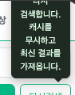
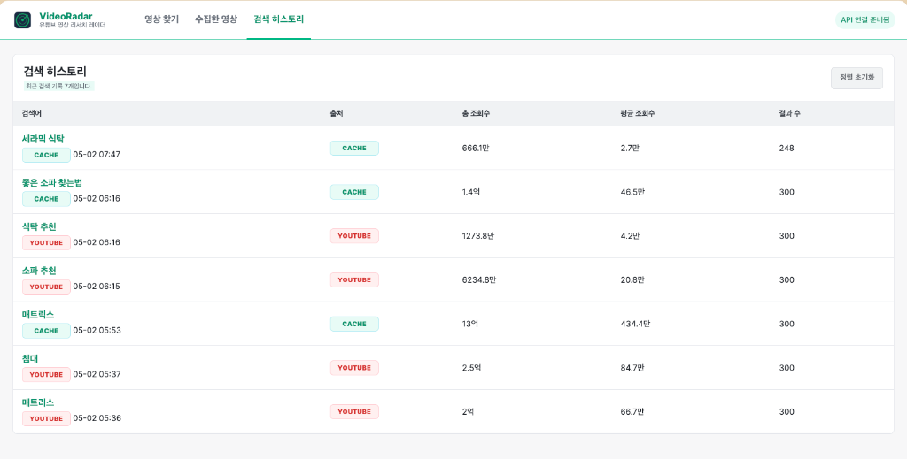

<div align="center">
  
  <h1>VideoRadar (비디오레이더)</h1>
  <p><b>"유튜브 데이터 분석과 수집을 위한 인텔리전트 리서치 플랫폼"</b></p>

  []()
  []()
  []()
  []()
</div>

<br />

## 🌟 개요 (Overview)
**VideoRadar**는 유튜브 API를 통해 특정 키워드의 영상 성과를 분석하고, 실시간으로 데이터를 수집하여 성과도가 높은 'Great' 영상을 발굴하는 도구입니다. 복잡한 API 호출과 데이터 정제 과정을 자동화하여 최적의 리서치 환경을 제공합니다.

<br />

## ✨ 주요 기능 (Key Features)

### 📊 데이터 분석 및 등급 시스템
- **Performance Index**: 조회수와 구독자 수를 비교 분석하여 영상의 실제 성과를 5단계(Great~Worst)로 평가합니다.
- **Contribution Score**: 영상이 채널에 미친 영향력을 자동으로 계산하여 시각화합니다.

### 🔍 스마트 리서치 도구
- **다이나믹 필터**: 조회수 범위, 쇼츠 여부, 등급별 필터링을 통해 필요한 데이터만 즉시 추출합니다.
- **CSV 내보내기**: 분석된 데이터를 엑셀 등에서 활용할 수 있도록 CSV 포맷으로 저장할 수 있습니다.

### 💾 하이브리드 캐시 시스템
- **DB 캐싱**: 검색된 데이터는 Supabase DB에 보관되어 API 할당량을 획기적으로 절약합니다.
- **실시간 갱신**: '다시 검색' 기능을 통해 캐시를 우회하고 최신 유튜브 데이터를 즉시 반영합니다.

<br />

## 📸 서비스 미리보기 (Screenshots)

### 1. 메인 분석 대시보드


### 2. 검색 히스토리 관리


### 3. 모바일 최적화 레이아웃


<br />

## ⚙️ 환경 설정 (Environment Variables)
프로젝트 실행을 위해 루트 디렉토리에 `.env` 파일을 생성하고 다음 정보를 입력해야 합니다.

```env
# 서버 설정
PORT=3000

# 유튜브 API 설정
YOUTUBE_API_KEY=your_youtube_api_key_here

# Supabase 데이터베이스 설정
SUPABASE_URL=your_supabase_project_url
SUPABASE_KEY=your_supabase_anon_key

# 캐시 설정 (시간 단위)
SEARCH_CACHE_TTL_HOURS=168
```

<br />

## 🛠 기술 스택 (Technical Stack)
- **Frontend**: Vanilla JavaScript, HTML5, CSS3 (BEM 방법론)
- **Backend**: Node.js, Express
- **Database**: Supabase (PostgreSQL)
- **API**: YouTube Data API v3

<br />

## 🚀 시작하기 (Getting Started)

1. **저장소 클론**
   ```bash
   git clone https://github.com/WisdomMax/videoradar.git
   cd videoradar
   ```

2. **의존성 설치**
   ```bash
   npm install
   ```

3. **서버 실행**
   ```bash
   npm run dev
   ```

<br />

---
<div align="center">
  Copyright © 2026 VideoRadar Project. All rights reserved.
</div>
